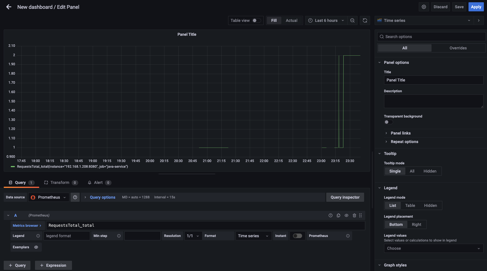
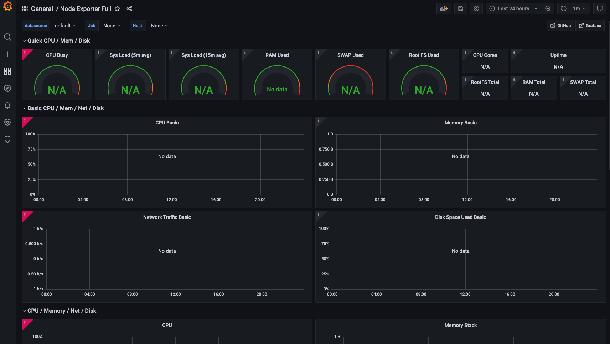

# Monitoring
Monitoring our application is very important for us to discover errors before the users even realize there were issues. Monitoring allows us to create custom metrics, visualize these metrics, and alert on these metrics whenever they go out of the normal threshold. Therefore, the moment customers encounter issues, we will immediately know the issue, where the issue is located, and take action on fixing the problem.

We will utilize [Prometheus](https://prometheus.io/), an open-source monitoring data store, to store our logs and metrics that this application creates. Then, we will integrate that with [Grafana](https://grafana.com/), an open-source data visualization tool, to visualize these metrics. Prometheus and Grafana work very well together since they're both open-source and have integration support for each other.

Get started by running `docker-compose up -d` to install and run Prometheus and Grafana in the background using Docker. The docker-compose.yml file was forked from https://github.com/vegasbrianc/prometheus/blob/master/docker-compose.yml. Then, run the Tomcat server of this Java EE web-app in Eclipse.

## Prometheus
Prometheus is an open-source systems monitoring and alerting toolkit that collects and stores its metrics as time series data (i.e. metrics info stored with a
timestamp). This is very helpful to efficiently monitor the app's health and pinpoint issues in the code.

View the Prometheus dashboard at http://localhost:9090

### Metrics and Logs
Prometheus, by default, polls every 15 seconds from the localhost:9090/metrics for new metrics/logs that were pushed. You can change the polling behavior in the `prometheus.yml` file to the `scrape_interval: 15s` property. It will listen to the metrics/logs on localhost:8080 (our Java service) as specified in the `job_name: 'java-service'` property. 

A metric is a numeric measurement of data that changes over time. For example, the number of failures that occurred in an API end-point can be a metric.

A log is a text info about information that occurred during the code execution. For example, when the server starts, logs are shown on the console to indicate that the server is starting and has been started. This project uses log4j to create the logs, to make sure the log4j2.xml file is loaded properly in your Eclipse project ensure the `src/main/resources` package is added in `Project > Properties > Build Path > Source`. To write logs into a `log.out` file, specify the absolute file path in the log4j2.xml file to the `fileName="<ABSOLUTE FILE PATH HERE>"` property.

### AlertManager
An alert is an alarm that send out notifications whenever a metric breaches a given threshold. For example, if there were 3 failures that happened in an specific API end-point over a 5 minute period, then alert the developer via a text message. Prometheus uses the [AlertManager](https://prometheus.io/docs/alerting/latest/alertmanager/#:~:text=The%20Alertmanager%20handles%20alerts%20sent,silencing%20and%20inhibition%20of%20alerts.) to handle alerts sent by the Prometheus server.

The AlertManager's config.yml file defines the notification services that will send notifications (e.g. SMS, email, Slack, and more). The alert.rules file defines the rules as to when to alert when a metric crosses a threshold.

View the alerts that were created at http://localhost:9090/alerts. When an alert detects an abnormality, it will be in "PENDING" state and update to a "FIRING" state if the "for" time period of the alert has been met.

### Node Exporter
[Node Exporter](https://github.com/prometheus/node_exporter) is a Prometheus exporter for server level and OS level metrics with configurable metric collectors. It helps us in measuring various OS resources such as RAM, disk space, and CPU utilization. Node exporter is a good solution to collect all the Linux server related metrics and statistics for monitoring. The Node Exporter setup is defined in the `prometheus.yml` file to the `job_name: 'node-exporter'` property. The Node exporter is not intended to monitor the Docker container running it, but instead the actual OS that is running the container.

Please note that Node Exporter is made for Linux, so it will not run on Mac due to the differences between the two operating systems. Instead, it's recommended to only use the cAdvisor on Mac.

### cAdvisor
[cAdvisor](https://github.com/google/cadvisor) exposes the metrics of individual containers running on the host, such as memory/CPU utilization. The difference between this and Node Exporter is that the Node Exporter exposes server (OS kernel) metrics while the cAdvisor exposes container metrics.

## Grafana
Grafana is a dashboard that displays graphs of your metrics from a data source (e.g. Prometheus) in an easier to read visualization with 3rd party plugins (e.g. Loki).

View the Grafana dashboard at http://localhost:3000

### 1. Add Prometheus data source to Grafana
Go to http://localhost:3000/datasources/new and select the "Prometheus" data source and set the URL to `http://<YOUR LOCAL IP ADDRESS>:9090` (e.g. `http://192.168.1.208:9090`).

### 2. Add a new panel to show case the RequestsTotal metric
Go to http://localhost:3000/dashboard/new?orgId=1&editPanel=2 and select the "Prometheus" data source. Now in the "Metrics browser" section type in "RequestsTotal_total" to see the number of requests made total. 

The graph should look somewhat like this:

Now click "Save" to save the panel.

### 3. Import 3rd party Dashboards
Go to http://localhost:3000/dashboard/import and find a 3rd party Dashboard to use. For example, https://grafana.com/grafana/dashboards/1860 is a dashboard for Node Exporter with the Grafana dashboard id of 1860. 

Once we import it, you can see that a new dashboard is created that looks like this below (the data in the image is N/A because Mac OS doesn't support Node Exporter):

